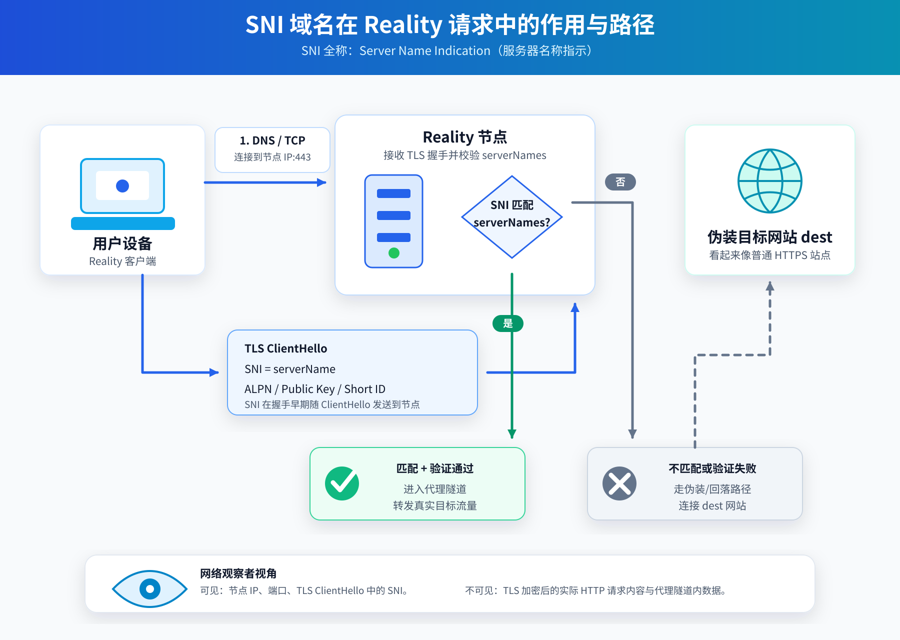

# RealiTLScanner

<p align="center">
  
</p>

<p align="center">
  <strong>高性能公网 TLS 嗅探器 —— 专为 Reality 协议寻找最佳伪装目标（域名与 IP）而生</strong>
</p>

<p align="center">
  
  
  
  
  
</p>

---

## 📖 目录

- [💡 简介与核心特性](#-简介与核心特性)
- [🖥️ 桌面应用程序版本使用说明 (Desktop GUI)](#️-桌面应用程序版本使用说明-desktop-gui)
  - [系统支持与快速启动](#系统支持与快速启动)
  - [界面结构与功能详解](#界面结构与功能详解)
  - [GeoIP 数据库一键下载与配置](#geoip-数据库一键下载与配置)
  - [数据持久化与自动保存](#数据持久化与自动保存)
- [💻 命令行版本使用说明 (CLI)](#-命令行版本使用说明-cli)
  - [快速上手](#快速上手)
  - [典型应用场景与命令示例](#典型应用场景与命令示例)
  - [完整 CLI 参数选项对照表](#完整-cli-参数选项对照表)
  - [优雅退出与数据保存机制](#优雅退出与数据保存机制)
- [🐳 Docker 容器化运行](#-docker-容器化运行)
- [📊 CSV 扫描结果解析与 Reality 选点指南](#-csv-扫描结果解析与-reality-选点指南)
- [🛠️ 源码编译与本地开发](#️-源码编译与本地开发)
- [🚀 GitHub 自动化构建打包与发布指南](#-github-自动化构建打包与发布指南)
- [❓ 常见问题与注意事项 (FAQ)](#-常见问题与注意事项-faq)

---

## 💡 简介与核心特性

配置 Xray / Sing-box 的 **Reality** 协议时，选择一个合适、稳定且真实的公网 TLS 伪装目标（SNI 与目标 IP）至关重要。传统手工逐个测试端口和证书既低效又容易选到被 CDN 劫持或已失效的目标。

**RealiTLScanner** 专注于公网大规模 TLS 服务嗅探与分析，自动验证目标是否支持 TLS 1.3、提取证书域名并进行 SNI 二次握手回验，输出规范的 CSV 数据。

本项目提供两种运行形态：
1. **桌面原生应用程序 (Desktop GUI)**：基于 Wails v2 + Vue 3 + Naive UI 打造，采用现代化暗黑极客美学界面设计，支持 Windows 与 macOS 原生窗口，可视化配置、实时进度仪表盘、结果表格即时检索与双击复制、日志流监控及 GeoIP 一键下载。
2. **命令行工具 (CLI)**：轻量单二进制文件、无任何外部依赖、极低资源占用，支持 Linux / Windows / macOS，支持脚本集成与自动化后台扫描，同时支持 Docker 容器化。

### 🌟 核心亮点
- **BGP / ASN 智能探测**：支持根据种子 IP 通过 RIPEstat 实时查询其所在的 BGP 宣告前缀网段或 ASN 广播的所有前缀，亦支持向周边相邻 IP 智能扩散。
- **多元化扫描目标**：支持单 IP、CIDR 掩码段、域名、本地批量文本文件（`.txt` 一行一个），以及直接抓取网页镜像源提取域名进行探测。
- **TLS 1.3 & ALPN 深度协商**：严密检查目标服务是否支持 TLS 1.3 及 ALPN（如 `h2`、`http/1.1`）。
- **SNI 二次握手复验**：获取证书中的域名后，自动携带该域名作为 SNI 发起真实握手二次检验，杜绝无效或拒绝 SNI 的伪目标。
- **TCP 高并发端口预过滤**：在 TLS 握手前使用毫秒级超短超时预探测目标端口连通性，自动过滤不开放端口，将整体扫描吞吐量提升数倍至数十倍。
- **MaxMind GeoIP 地理位置识别**：自动解析目标 IP 所在国家/地区代码，GUI 支持一键在线下载最新 `Country.mmdb` 数据库。
- **优雅取消与安全落盘**：无论是 CLI 按下 `Ctrl+C` 还是桌面版点击“停止”，均实现协程安全取消并自动 Flush CSV 数据，绝不丢失已扫到的结果。

> ⚠️ **温馨提示**：强烈建议在本地个人宽带或网络环境运行；在部分风控敏感的云厂商 VPS 上高并发扫描公网可能触发机房安全审计或被限速。

---

## 🖥️ 桌面应用程序版本使用说明 (Desktop GUI)

桌面版本为普通用户与运维人员提供了直观、简洁、大气的可视化操作界面。

### 系统支持与快速启动

- **Windows** (Windows 10 / Windows 11，支持 x64 / ARM64)：
  - 从 [Releases 页面](https://github.com/ice-juice/RealiTLScanner/releases) 下载 `RealiTLScanner-<version>-windows-x64-gui.zip`。
  - 解压后双击 `RealiTLScanner.exe` 即可运行（绿色免安装）。
  - *环境说明*：Windows 11 已自带系统 WebView2 运行时；如在精简版 Windows 10 提示缺少运行时，请安装微软官方 [WebView2 Evergreen Runtime](https://developer.microsoft.com/en-us/microsoft-edge/webview2/)。
- **macOS** (支持 macOS 10.15+，包含 Intel 与 Apple Silicon M系列全系 Universal 架构)：
  - 下载 `RealiTLScanner-<version>-macos-universal-gui.zip` 或 `.tar.gz`。
  - 解压后将 `RealiTLScanner.app` 拖入 `Applications`（应用程序）文件夹即可。
  - *解除隔离*：由于应用未加入付费开发者签名，macOS 首次打开可能提示“应用已损坏”或“无法验证开发者”，只需打开终端执行以下命令即可正常运行：
    ```bash
    xattr -dr com.apple.quarantine /Applications/RealiTLScanner.app
    ```

### 界面结构与功能详解

应用程序界面分为 **顶部栏**、**左侧控制面板**、**右侧工作区** 和 **底部全局状态栏** 四大部分：

```
+-----------------------------------------------------------------------------------+
|  [盾牌徽标] RealiTLScanner v0.2.0     [GeoIP:就绪/下载]  [打开输出目录]  [主题切换]  |
+------------------------------------+----------------------------------------------+
| [目标输入]                          | [选项卡: 命中目标 (Results) | 实时日志 (Logs)]|
|   (•) 单目标  ( ) 文件  ( ) 网页    | +------------------------------------------+ |
|   [ 131.143.251.229              ] | | 搜索过滤...          [清空] [定位CSV文件] | |
|                                    | |------------------------------------------| |
| [核心参数]                          | | IP        | 证书域名   | TLS | ALPN | 地区 | |
|   端口: 443      超时: 10s         | |-----------+------------+-----+------+------| |
|   扫描线程: 100  预探测线程: 300    | | 107.172.. | rocky-..   | 1.3 | h2   | US   | |
|                                    | | (双击任意数据行可快速复制整条结果)         | |
| [扫描范围]                          | +------------------------------------------+ |
|   [✓ BGP前缀] [ ASN广播] [ 相邻IP] |                                              |
|                                    |                                              |
| [▶ 开始扫描]        [⏹ 停止]      |                                              |
| [▼ 高级选项] (折叠面板)             |                                              |
+------------------------------------+----------------------------------------------+
| [🟢 正在扫描...]  已生成: 4096 | 探测: 1200 | 命中: 18 | 速率: 85 ips/s | 耗时: 14s |
+-----------------------------------------------------------------------------------+
```

#### 1. 顶部操作栏
- **GeoIP 状态指示器**：动态检测应用配置目录下是否存在 `Country.mmdb`。若未检测到，会显示醒目的下载徽章，点击可直接触发内建下载器从权威源自动拉取并实时加载，无需手动放置文件。
- **打开输出目录**：一键在 Windows 资源管理器或 macOS Finder 中打开 CSV 保存目录（默认为 `~/Documents/RealiTLScanner`）。
- **主题切换**：支持深色极客风（Dark Slate & Emerald）与浅色清新风（Light Mode）一键切换，并自动记忆用户选择。

#### 2. 左侧控制面板
- **目标输入模式**：
  - **单目标 (`addr`)**：支持单个 IPv4/IPv6 地址（如 `1.1.1.1`）、CIDR 掩码段（如 `104.16.0.0/16`）或域名（如 `www.microsoft.com`，自动解析后扫描）。
  - **文件导入 (`file`)**：选择本地 `.txt` 文件（每行一个目标，支持点击右侧“浏览”按钮唤起文件选择器）。
  - **网页爬取 (`url`)**：输入包含镜像列表或域名列表的网页链接（如 `https://launchpad.net/ubuntu/+archivemirrors`），程序将自动抓取其中的域名并建立探测流水线。
- **核心扫描参数**：
  - **端口 (Port)**：要检测的 HTTPS 端口，默认为 `443`。
  - **握手超时 (Timeout)**：单次 TLS 握手最大等待秒数，默认 `10` 秒。
  - **扫描并发 (Scan Threads)**：同时发起 TLS 握手测试的并发协程数，默认 `100`。
  - **预探测并发 (Probe Threads)**：TCP 端口预过滤的并发连接数，默认 `300`（桌面端独立分离此参数，实现更高速的非活跃端口剔除）。
- **扫描范围策略 (Scope)**：
  - **BGP 前缀 (`prefix`，默认推荐)**：查询目标 IP 所在的 BGP 宣告网络块并扫描该网段中的所有活跃地址。
  - **ASN 自治域 (`asn`)**：查询目标 IP 归属的整个自治系统 (Autonomous System) 所宣告的所有 IP 前缀并展开扫描。
  - **相邻 IP (`nearby`)**：以目标 IP 为中心，向相邻数字序列的 IP 扩散。
- **高级选项折叠面板**：
  - **SNI 二次复验 (`verify-sni`)**：默认开启。扫描到证书后，将证书内绑定的域名作为 SNI 重新发起一次真实 TLS 握手，确保伪装服务能正常通过客户端验证。
  - **TCP 端口预过滤 (`port-probe`)**：默认开启。先用极短连接测试目标端口，不通则跳过，极大提升整体吞吐量。
  - **启用 IPv6 (`-46`)**：默认关闭。勾选后将同时探测目标的 IPv6 地址。
  - **详细日志 (`verbose`)**：开启后将输出更详细的网络连接与解析细节。
  - **单目标生成上限 (`limit`)**：默认 `4096`；**填 `0` 则启用“连续模式”**（持续向目标两侧 IP 扩散探测，永不停歇，直到手动点击停止）。
  - **ASN 前缀数上限**：限制查询 ASN 时抓取的前缀块数量，默认 `32`。
  - **预探测超时**：TCP 预探测超时秒数，默认 `1` 秒。
  - **输出文件路径**：自定义结果保存位置，支持点击“浏览”选取保存路径。
  - **GeoIP 数据库路径**：自定义本地 `Country.mmdb` 的绝对路径。

#### 3. 右侧工作面板
- **选项卡 1：命中目标 (Results)**：
  - 动态响应式表格展示探测成功的有效目标：包含目标 IP（技术蓝等宽字体）、证书域名（翡翠绿高亮）、TLS 版本（紫色彩标）、ALPN（绿色标）、证书颁发机构（Issuer）以及国家/地区代码。
  - **顶部工具条**：支持在输入框内键入 IP 或域名实时过滤显示；提供“清空表格”按钮；提供“定位文件”快捷按钮直接打开当次生成的 CSV 文件。
  - **便捷复制**：双击任意数据行，即可自动将该行的 IP、域名与关键配置格式化复制到系统剪贴板。
- **选项卡 2：实时日志 (Logs)**：
  - 嵌入式暗黑极客控制台终端，实时显示扫描器引擎日志。
  - 每条日志带有精确时间戳、行号及彩色级别标签（`INFO`、`WARN`、`ERROR`、`DEBUG`）。
  - 支持日志内容关键字实时搜索筛选、自动滚屏跟随开关与日志一键清空。

#### 4. 底部全局状态栏
- **状态指示器**：
  - 空闲状态 (`Idle`)：灰色圆点。
  - 规划分析中 (`Planning`)：橙色状态指示。
  - 正在扫描 (`Scanning`)：带有呼吸跳动光晕动画的绿色指示灯。
  - 已完成 / 已停止 (`Completed` / `Stopped`)：蓝色 / 红色指示灯。
- **实时指标流 (Live Metrics)**：
  - **已生成**：已通过规划器展开的待测目标总数。
  - **已探测**：TCP 预探测已完成连接测试的目标数。
  - **通过**：成功通过 TCP 握手并递交 TLS 扫描的目标数。
  - **命中**：完全符合 TLS 1.3 及 SNI 复验要求的可用 Reality 目标数。
  - **速率**：实时扫描速度（每秒处理 IP 数，`ips/s`）。
  - **耗时**：当次扫描已持续的时间。

### GeoIP 数据库一键下载与配置

程序依靠 MaxMind GeoLite2 Country 数据库解析目标 IP 的地理位置归属：
- **桌面版自动感知**：启动时会自动检查本地配置目录。如果缺失数据库，界面顶部将亮起黄色“下载”徽章，点击即可全自动后台下载 `Country.mmdb` 并热加载。
- **手动放置路径**：
  - Windows: `%APPDATA%\RealiTLScanner\Country.mmdb`
  - macOS: `~/Library/Application Support/RealiTLScanner/Country.mmdb`
  - Linux: `~/.config/RealiTLScanner/Country.mmdb`

### 数据持久化与自动保存

- **配置持久化**：每次运行的参数设置（目标类型、端口、并发线程、超时、高级选项及主题偏好）均会自动保存在系统配置目录的 `settings.json` 中，再次打开应用时自动恢复。
- **安全落盘机制**：每次扫描均会自动在输出目录创建以时间戳命名的 CSV 文件（如 `scan-20260915-120000.csv`）。每发现一条可用目标均实时刷盘，即便扫描中途异常关闭电脑或强行退出，已扫描到的数据也绝对完整保留。

---

## 💻 命令行版本使用说明 (CLI)

命令行版本为单文件二进制程序，无需图形环境，非常适合部署在 Linux 服务器、跳板机或作为定时任务运行。

### 快速上手

命令行版本要求必须指定且只能指定 `-addr`、`-in`、`-url` 三个目标参数之一。

```bash
# 查看完整帮助信息
./RealiTLScanner -h

# 基础示例：扫描单个 IP 所在 BGP 宣告段，并发 100 线程，输出到 out.csv
./RealiTLScanner -addr 131.143.251.229 -thread 100
```

### 典型应用场景与命令示例

#### 1. 扫描单个 IP 所在 BGP 宣告前缀（最常用）
```bash
./RealiTLScanner -addr 107.172.1.1 -scope prefix -limit 4096 -thread 100
```
> 程序会查询 RIPEstat 获取 `107.172.1.1` 所在的网段前缀（如 `/24`），并在该网段内生成并扫描最多 4096 个目标。

#### 2. 连续永续扫描模式（`-limit 0`）
```bash
./RealiTLScanner -addr 107.172.1.1 -scope prefix -limit 0 -thread 150
```
> 当 `-limit` 设为 `0` 时，扫描器进入持续扫描状态：先将当前 BGP 网段完整扫完，随后向该网段前后两侧的相邻 IP 持续发散扫描，永不停歇，直到手动按下 `Ctrl+C` 退出。

#### 3. 扫描指定 ASN 自治域下的全部广播前缀
```bash
./RealiTLScanner -addr 1.1.1.1 -scope asn -asn-prefixes 32 -limit 10000 -thread 200
```
> 自动查询 `1.1.1.1` 所属的 Cloudflare 自治域（AS13335），拉取其广播的最多 32 个前缀，并从中并发扫描 10000 个目标。

#### 4. 扫描相邻 IP 序列
```bash
./RealiTLScanner -addr 107.172.103.9 -scope nearby -limit 1024 -thread 50
```
> 以种子 IP 为核心向周围相邻 IP 地址辐射探测。

#### 5. 直接扫描整个 CIDR 掩码网段
```bash
./RealiTLScanner -addr 104.16.0.0/16 -thread 200 -out cloudflare.csv
```

#### 6. 直接扫描域名（自动解析 IP）
```bash
./RealiTLScanner -addr www.microsoft.com -thread 50
```

#### 7. 从本地列表文件批量扫描
准备 `targets.txt`，每行一个 IP、CIDR 或域名：
```text
1.1.1.1
8.8.8.8
104.24.0.0/20
gateway.icloud.com
```
执行命令：
```bash
./RealiTLScanner -in targets.txt -thread 100 -out results.csv
```

#### 8. 从网页爬取域名列表进行全球扫描
```bash
./RealiTLScanner -url https://launchpad.net/ubuntu/+archivemirrors -thread 50 -timeout 5
```

#### 9. 高带宽极速并发配置
对于千兆带宽或低延迟网络，可调高线程并缩短超时：
```bash
./RealiTLScanner -addr 38.80.191.155 -thread 300 -timeout 3 -probe-timeout 1 -limit 10000
```

#### 10. 详细调试日志与 IPv6 支持
```bash
./RealiTLScanner -addr 2606:4700::6810:85e5 -46 -v
```

### 完整 CLI 参数选项对照表

CLI 严格保持 15 个标准参数定义，完全向下兼容：

| 参数 Flag | 类型 | 默认值 | 详细功能说明 |
| :--- | :---: | :---: | :--- |
| **`-addr`** | 字符串 | `""` | 指定单个探测目标：可填单个 IPv4/IPv6、CIDR 网段（如 `1.2.3.0/24`）或域名 |
| **`-in`** | 字符串 | `""` | 指定包含多个目标的文本文件路径，按行分割 |
| **`-url`** | 字符串 | `""` | 指定目标网页 URL，程序自动爬取网页 HTML 中包含的所有域名 |
| **`-port`** | 整数 | `443` | 指定要测试的 HTTPS/TLS 端口 |
| **`-thread`** | 整数 | `2` | 并发执行任务数（同时控制 TCP 预探测与 TLS 握手并发协程数） |
| **`-out`** | 字符串 | `out.csv` | 扫描结果保存的 CSV 文件路径 |
| **`-timeout`** | 整数 | `10` | 单次 TLS 握手最大超时等待时间（单位：秒） |
| **`-scope`** | 字符串 | `prefix` | 单 IP 目标扩展策略：`prefix`（BGP前缀，默认）、`asn`（自治域）、`nearby`（相邻IP） |
| **`-limit`** | 整数 | `4096` | 单 IP 模式生成的最大待测目标数；**设置为 `0` 表示不设上限的连续扫描模式** |
| **`-probe-timeout`** | 整数 | `1` | TCP 端口存活预探测的超时时间（单位：秒） |
| **`-no-port-probe`** | 布尔 | `false` | 关闭 TCP 预探测过滤，直接对所有生成的目标发起完整 TLS 握手 |
| **`-verify-sni`** | 布尔 | `true` | 在提取出证书域名后，使用该域名作为 SNI 发起真实握手二次复验 |
| **`-asn-prefixes`** | 整数 | `32` | 在 `-scope asn` 模式下抓取该 ASN 宣告前缀的最大数量限制 |
| **`-46`** | 布尔 | `false` | 开启 IPv6 支持，在探测域名时同时解析并扫描 IPv6 地址 |
| **`-v`** | 布尔 | `false` | 输出详细调试追踪日志（Verbose Mode） |

### 优雅退出与数据保存机制

在扫描过程中，如需提前结束，可直接在终端中按下 `Ctrl + C`（或发送 `SIGTERM` / `SIGINT` 信号）：
- 程序会立即截断待探测队列，安全停止所有工作协程。
- 已探测并命中成功的 TLS 结果已在产生时实时同步刷盘（Flush）至 CSV 文件中，不会造成数据丢失或文件破损。

---

## 🐳 Docker 容器化运行

RealiTLScanner 提供了官方优化的多阶段轻量 Dockerfile，镜像基于 Alpine Linux，体积极小。

### 1. 构建镜像
```bash
docker build -t realitlscanner:latest .
```

### 2. 运行扫描并将结果映射到宿主机
```bash
# 将当前目录挂载到容器内，保证生成的 out.csv 保存在宿主机
docker run --rm -it -v "$(pwd):/app" realitlscanner:latest -addr 131.143.251.229 -thread 100 -out out.csv
```

### 3. 挂载本地 GeoIP 数据库运行
```bash
docker run --rm -it -v "$(pwd):/app" realitlscanner:latest -addr 1.1.1.1 -scope prefix
```
> 只需将下载好的 `Country.mmdb` 放置在当前宿主机执行目录下，挂载后程序即可自动识别国家代码。

---

## 📊 CSV 扫描结果解析与 Reality 选点指南

扫描结果输出为严格遵循 RFC 4180 标准的 11 列 CSV 文件：

```csv
IP,ORIGIN,TLS,ALPN,CURVE,CERT_LENGTH,CERT_SIGNATURE,CERT_PUBLICKEY,CERT_DOMAIN,CERT_ISSUER,GEO_CODE
```

### 字段含义对照表

| 列名 | 示例值 | 含义说明 | 对 Reality 配置的参考价值 |
| :--- | :--- | :--- | :--- |
| **`IP`** | `107.172.103.9` | 目标的实际响应 IP 地址 | **核心配置**：填入 Reality 节点的 `dest` / `server` IP 地址 |
| **`ORIGIN`** | `107.172.103.9` | 探测源（种子 IP / 域名 / 文件行） | 追溯目标来源 |
| **`TLS`** | `1.3` | 服务端协商的 TLS 协议版本 | **必须为 1.3**：Reality 协议强依赖 TLS 1.3 握手特征 |
| **`ALPN`** | `h2` 或 `http/1.1` | 应用层协议协商结果 | 优先选择包含 `h2`（HTTP/2）的目标，伪装度最高 |
| **`CURVE`** | `X25519` | 密钥交换所采用的椭圆曲线 | 现代常见为 `X25519` 或 `P-256` |
| **`CERT_LENGTH`** | `2` | 服务端下发的证书链长度 | 证书链完整性指标 |
| **`CERT_SIGNATURE`** | `SHA256-RSA` | 证书签名算法类型 | 常见有 SHA256-RSA、ECDSA 等 |
| **`CERT_PUBLICKEY`** | `RSA-2048` | 证书公钥算法与位数 | 评估目标站点的加密套件特征 |
| **`CERT_DOMAIN`** | `rocky-linux.tk` | 证书中包含的主域名或 SAN 域名 | **核心配置**：填入 Reality 客户端的 `serverName` (SNI) |
| **`CERT_ISSUER`** | `Let's Encrypt` | 证书颁发机构 CA | 常见为 Let's Encrypt、DigiCert、Cloudflare、ZeroSSL 等 |
| **`GEO_CODE`** | `US` | 目标服务器物理所在国家/地区代码 | 辅助筛选机房位置（如 US、HK、JP、SG、DE） |

### 🎯 如何挑选优质 Reality 目标节点？

<p align="center">
  
</p>

1. **协议版本强校验**：`TLS` 必须为 `1.3`，非 1.3 的目标直接舍弃。
2. **ALPN 优选 h2**：`ALPN` 最好包含 `h2`，因为绝大多数现代网站（如大型跨国企业、开源镜像站）均支持 HTTP/2。
3. **同机房/就近原则**：选择 `IP` 与你的 VPS 处于**相同机房、同一 ASN 或同一地理区域**的目标。例如你的 VPS 位于美国西海岸，优先挑选同样位于美西的前缀 IP，握手往返延迟（RTT）极低，特征最为自然真实。
4. **权威证书颁发机构**：优先选择 `DigiCert`、`Let's Encrypt`、`Sectigo`、`GlobalSign` 等公信度高的大型商业 CA 签发的证书。
5. **避开大型 CDN 泛解析域名**：尽量选择独立企业、大学或开源镜像站的目标 IP，避免使用 Cloudflare 等会重定向至任意任播节点的域名，以防握手证书特征与 IP 归属不符。

---

## 🛠️ 源码编译与本地开发

### 开发环境准备
- **Go**：`1.26` 或更高版本（需支持现代 Go 特性）。
- **Node.js**：`18.0.0` 或更高版本（推荐使用 LTS 版本，例如 Node 20+）。
- **Wails CLI**（桌面开发必需）：
  ```bash
  go install github.com/wailsapp/wails/v2/cmd/wails@latest
  # 运行环境检查工具
  wails doctor
  ```
- **C 编译器**（桌面开发必需）：
  - Windows: 安装 MinGW-w64 / TDM-GCC（将 `gcc.exe` 添加至系统 PATH）。
  - macOS: 安装 Xcode Command Line Tools (`xcode-select --install`)。
  - Linux: 安装 `build-essential` 与 `libgtk-3-dev`、`libwebkit2gtk-4.0-dev`。

### 1. 编译命令行版本 (CLI)
```bash
# 根目录下执行
go build -trimpath -ldflags "-s -w" -o dist/RealiTLScanner ./cmd/cli
```

### 2. 桌面版原生应用开发模式 (Hot Reload)
```bash
# 进入桌面开发模式（前端热更新 + Go 后端热重载）
wails dev
```

### 3. 编译发布桌面版原生应用
```bash
# 编译当前系统的原生可执行程序
wails build -ldflags "-s -w"

# Windows x64 便携版（产物在 build/bin/RealiTLScanner.exe）
wails build -platform windows/amd64 -ldflags "-s -w"

# macOS Universal 双架构应用（产物在 build/bin/RealiTLScanner.app）
wails build -platform darwin/universal -ldflags "-s -w"
```

### 4. 浏览器 WebUI 回退版（无 Wails 依赖时备用）
若某些老旧服务器或特殊操作系统无法编译 Wails 桌面端，可使用纯 Go 实现的 WebUI 备用后端：
```bash
go run ./cmd/desktop
# 控制台会输出监听地址，浏览器打开 http://127.0.0.1:34115 即可
```

### 5. 运行完整单元测试
```bash
go test -v ./...
```

---

## 🚀 GitHub 自动化构建打包与发布指南

本项目已配置完善的企业级 GitHub Actions 持续集成与发布工作流（位于 [`.github/workflows/release.yml`](.github/workflows/release.yml)）。

当你在 GitHub 仓库中推送一个遵循 `v*.*.*` 语义化版本规则的 Git Tag 时，GitHub Actions 会自动触发矩阵构建：
- **跨平台 CLI 构建 (Ubuntu Runner)**：同时编译 Windows (x86/x64/arm64)、Linux (x86/x64/arm64)、macOS (Intel/Apple Silicon) 全架构 CLI 资产并压缩打包。
- **Windows 原生桌面构建 (Windows Runner)**：自动安装 Wails CLI、Node.js 与 NSIS，一键构建 Windows 原生 x64 绿色版（`.zip`）及可选安装包（`installer.exe`），同时生成 Windows WebUI 回退包。
- **macOS 原生桌面构建 (macOS Runner)**：自动构建原生 Universal 双架构 `RealiTLScanner.app` 并压缩为 `.zip` 与 `.tar.gz`，同时生成 macOS WebUI 回退包。
- **自动化发布 Release (Release Job)**：收集所有构建资产，自动计算所有发布文件的 `SHA256` 校验和写入 `SHA256SUMS.txt`，生成排版优美的 Release 说明并发布到 GitHub Releases。

### 📌 如何发布一个新版本？

只需在本地执行以下三条 Git 命令即可：

```bash
# 1. 确保当前分支所有代码已提交
git status

# 2. 创建附注标签（例如发布 v0.2.0）
git tag -a v0.2.0 -m "Release v0.2.0: Modern Desktop GUI & Optimized CLI"

# 3. 推送 Tag 至 GitHub 远端仓库
git push origin v0.2.0
```

推送后，打开你的 GitHub 仓库的 **Actions** 页面即可实时查看构建流水线进度。构建完成后，可在 **Releases** 页面查看并下载全套打包资产。

### 📦 Release 发布资产一览

| 资产文件名 | 适用操作系统 | 架构类型 | 说明 |
| :--- | :--- | :--- | :--- |
| `RealiTLScanner-<ver>-windows-x64-gui.zip` | Windows 10/11 | 64位 (x64) | **桌面原生 GUI** 绿色免安装版，解压即用 |
| `RealiTLScanner-<ver>-windows-x64-gui-installer.exe` | Windows 10/11 | 64位 (x64) | **桌面原生 GUI** 独立安装程序 |
| `RealiTLScanner-<ver>-macos-universal-gui.zip` | macOS 10.15+ | M系列 & Intel 双架构 | **桌面原生 GUI** macOS 应用程序包（`.app`） |
| `RealiTLScanner-<ver>-cli-windows-x64.zip` | Windows | 64位 (x64) | 命令行单文件压缩包 |
| `RealiTLScanner-<ver>-cli-windows-arm64.zip` | Windows | ARM64 | 适用于 ARM 版 Windows 的命令行程序 |
| `RealiTLScanner-<ver>-cli-linux-x64.tar.gz` | Linux | 64位 (x64) | Linux 服务器常用命令行程序 |
| `RealiTLScanner-<ver>-cli-linux-arm64.tar.gz` | Linux | ARM64 (aarch64) | 树莓派、甲骨文 ARM 等服务器命令行程序 |
| `RealiTLScanner-<ver>-cli-macos-apple-silicon.tar.gz`| macOS | Apple Silicon (M1/M2/M3/M4) | macOS 原生终端命令行工具 |
| `RealiTLScanner-<ver>-cli-macos-intel.tar.gz` | macOS | Intel x64 | Intel 处理器 Mac 终端命令行工具 |
| `RealiTLScanner-<ver>-*-webui.*` | 多系统平台 | 各自对应架构 | 浏览器 WebUI 备用回退包 |
| `SHA256SUMS.txt` | 全平台通用 | - | 所有发布文件的 SHA-256 校验和清册 |

---

## ❓ 常见问题与注意事项 (FAQ)

### Q1: 扫描会被云厂商警告或封禁端口吗？
答：**有一定风险**。部分国际大型云服务商（如 AWS、Azure、阿里云国际等）的 ToS 中对从实例向公网未授权 IP 发起连续 TCP 端口探测有严格风控。因此，**强烈建议在个人家庭网络、独立合规宽带或允许安全探测的专用服务器上运行**。

### Q2: 为什么扫出的部分域名在浏览器打开提示 404 / 403？
答：这是完全正常的现象。很多云服务商反向代理或内部微服务集群在直接通过 IP 访问或未携带特定 HTTP 路由头部时，会默认返回 403 Forbidden、404 Not Found 甚至 400 Bad Request。**只要该目标的 TLS 握手成功（1.3 版本）、证书有效且支持指定 ALPN，它就是一个完全符合 Reality 伪装标准的优质节点**，因为 Reality 协议借用的是其 TLS 层的外在特征。

### Q3: macOS 提示“已损坏，无法打开”怎么解决？
答：这是苹果系统的 Gatekeeper 对未签署昂贵 Apple Developer 商业证书的开源软件实施的安全隔离机制。请在 macOS 终端中运行：
```bash
xattr -dr com.apple.quarantine /Applications/RealiTLScanner.app
```
运行后即可正常打开。

### Q4: Windows Defender 报毒或误报怎么办？
答：本工具为开源网络探测工具，且包含原生网络并发握手与证书解析行为。未经商业代码签名的可执行程序很容易被杀毒软件的“启发式规则（Heuristic）”误判。所有源码均公开透明，用户可自行审查代码并在本机自行通过 `wails build` 或 `go build` 进行编译，或将程序加入杀软信任白名单。

### Q5: 为什么单 IP 模式下有时候扫出的目标比较少？
答：在 `-scope prefix` 模式下，程序通过 RIPEstat 查询该种子 IP 所在的 BGP 宣告前缀。如果该 IP 所在的前缀较小（例如 `/29` 或 `/28`，仅有几个或十几个 IP），待测目标就会很快测完。此时建议：
1. 选用 `-scope asn`（扩大至整个自治系统广播网段）。
2. 或将 `-limit` 设为 `0` 进入连续扩散模式，自动向前后相邻网段无限制发散扫描。

---

## 📄 开源许可证 (License)

本项目基于 [MIT License](LICENSE) 开源。欢迎提交 Pull Request、Issue 或 Star 给予支持！
